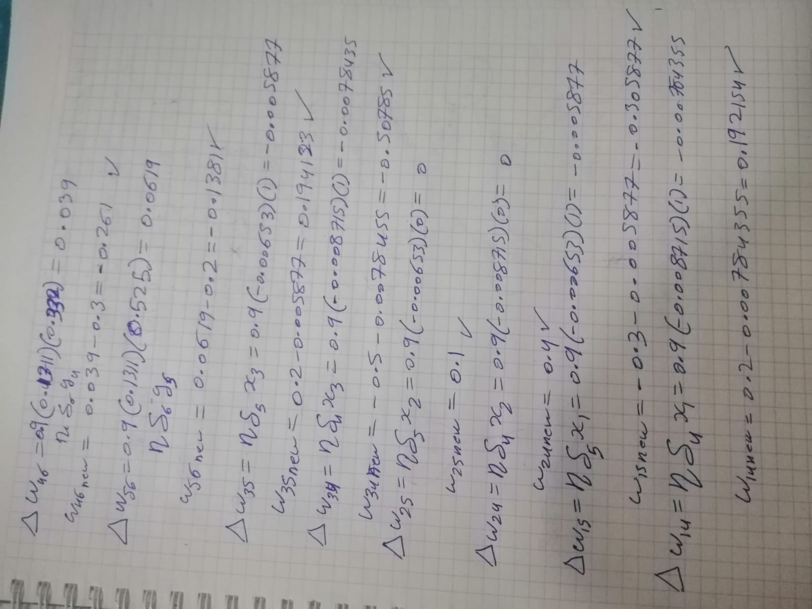
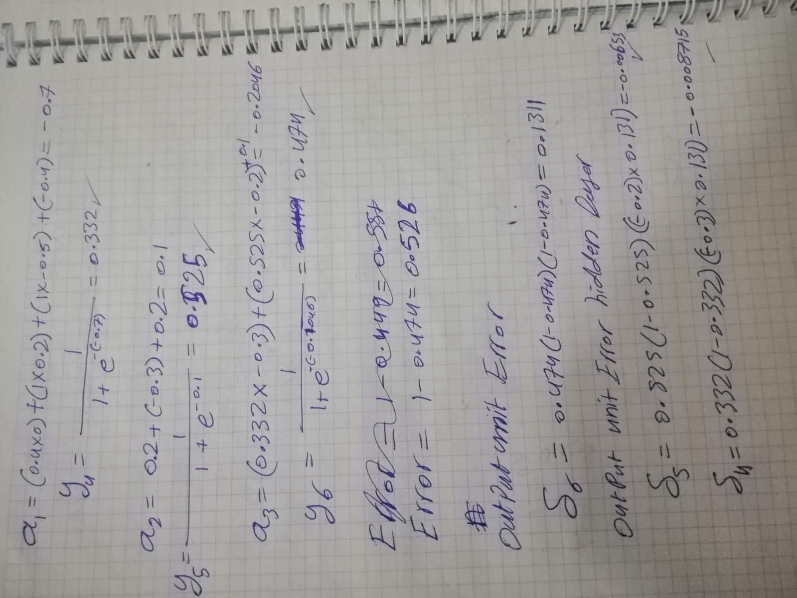
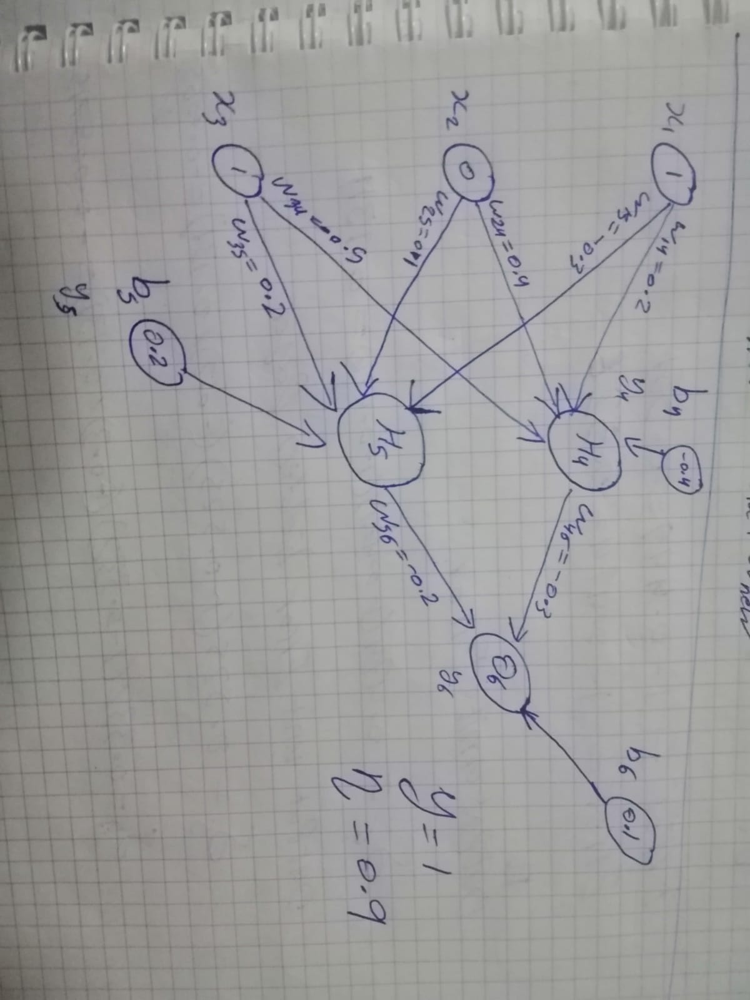
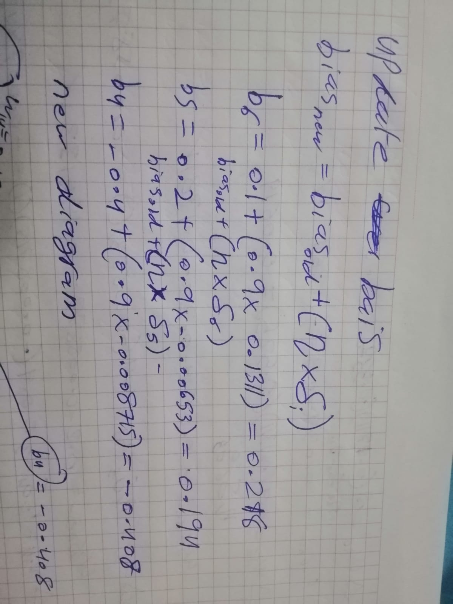

---
date:
  created: 2025-07-13
readtime: 5
authors:
    - salmanabulatif
---

# Neural Network

Neural networks rely on two key mathematical processes: **forward propagation** (for predictions) and **backward propagation** (for learning via gradient descent).

<!-- more -->

# The Math Behind Neural Network Forward and Backward Propagation

Neural networks rely on two key mathematical processes: **forward propagation** (for predictions) and **backward propagation** (for learning via gradient descent). In this post, we break down the core math behind these steps using a simple 3-layer neural network example. Hand-written calculations and diagrams from my notes are included for clarity.

---

## Network Architecture

We consider a neural network with:

- **Input layer:** 3 neurons (x₁, x₂, x₃)
- **Hidden layer:** 2 neurons (h₄, h₅)
- **Output layer:** 1 neuron (o₆)

```
Input Layer (x₁, x₂, x₃) → Hidden Layer (h₄, h₅) → Output Layer (o₆)
```



---

## 1. Forward Pass

The forward pass computes the output of each neuron layer-by-layer using weights (ω), biases (b), and activation functions (sigmoid here).

### Hidden Layer Calculations

For neuron 4 (h₄):

```
a4 = sigmoid(inputs * weights + b4)
```

From the notes:

```
a4 = 1 / (1 + exp(-(-0.7))) = 0.332
```

For neuron 5 (h₅):

```
a5 = 1 / (1 + exp(-0.1)) = 0.325
```

### Output Layer Calculation

```
o6 = sigmoid(a4 * ω46 + a5 * ω56 + b6)
```

```
a6 = 1 / (1 + exp(-(-0.206))) = 0.194
```



---

## 2. Loss Calculation

The error (loss) is computed between the prediction (o₆) and the target value.

From the notes (target = 1):

```
Error = 1 - 0.414 = 0.526
```

---

## 3. Backward Propagation

Backward propagation applies the chain rule to compute gradients for each weight and bias.

### Output Neuron Gradient (δ₆)

```
δ6 = Error × sigmoid'(o6)
```

where

```
sigmoid'(z) = sigmoid(z) * (1 - sigmoid(z))
```

From the notes:

```
δ6 = 0.414 × (1 - 0.414) × (1 - 0.414) = 0.131
```

### Hidden Neuron Gradients

For neuron 5 (δ₅):

```
δ5 = a5 * (1 - a5) × (δ6 * ω56)
δ5 = 0.325 × (1 - 0.525) × (0.2 × 0.131) = 0.095
```

For neuron 4 (δ₄):

```
δ4 = a4 * (1 - a4) × (δ6 * ω46)
δ4 = 0.332 × (1 - 0.332) × (0.2 × 0.131) = 0.095
```



---

## 4. Weight Updates

Weights are updated using the computed gradients and a learning rate (η=0.9).

**Update Rule:**

```
Δωij = η × δi × aj
ωij_new = ωij_old + Δωij
```

**Example Updates (see notes):**

- Weight ω16 (input 1 → output 6):

    ```
    Δω16 = 0.9 × 0.131 × 0.392 = 0.046
    ω16_new = 0.939 - 0.3 = 0.639
    ```

- Weight ω35 (input 3 → hidden 5):

    ```
    Δω35 = 0.9 × 0.00653 × 1 = 0.00588
    ω35_new = 0.2 - 0.00857 = 0.19143
    ```

---

## 5. Bias Updates

Biases are updated similarly:

```
bi_new = bi_old + η × δi
```

For output neuron 6:

```
b6_new = 0.1 + (0.9 × 0.131) = 0.218
```



---

## Key Equations

| Component         | Equation                                              |
| ----------------- | ---------------------------------------------------- |
| Forward Pass      | a_j = sigmoid(sum_over_i(ω_ij * x_i) + b_j)          |
| Sigmoid           | sigmoid(z) = 1 / (1 + exp(-z))                       |
| Output Gradient   | δ_k = (y - y_hat) * sigmoid'(o_k)                    |
| Hidden Gradient   | δ_j = sigmoid'(a_j) * sum_over_k(δ_k * ω_jk)         |
| Weight Update     | Δω_ij = η * δ_j * a_i                                |
| Bias Update       | Δb_j = η * δ_j                                       |

---

## Why This Matters

Backpropagation efficiently computes gradients by:

1. **Forward pass:** Calculate predictions and cache values.
2. **Backward pass:** Apply the chain rule for error gradients.
3. **Update:** Adjust weights and biases to minimize loss.

Your files and these notes demonstrate a practical implementation of these principles—calculating gradients and updating weights. While the math may appear complex, it systematically optimizes the network using calculus and linear algebra.

---

*Handwritten notes and calculations for visual reference:*

- Network diagram: 
- Forward pass & error calculation: 
- Backpropagation and weight update math: 
- Bias update math: 

---

**References:**  
- [Neural Networks and Deep Learning](http://neuralnetworksanddeeplearning.com/)
- [CS231n: Convolutional Neural Networks for Visual Recognition (Stanford)](http://cs231n.github.io/neural-networks-2/)